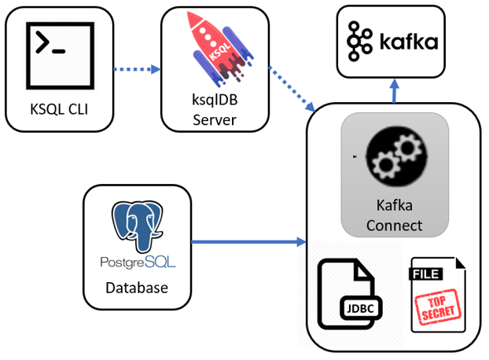

# Get started

## Prerequisites & setup
- clone this repo!
- install docker/docker-compose
- set your Docker maximum memory to something really big, such as 10GB. (preferences -> advanced -> memory)

## Docker Startup
```
docker-compose -d
```


# Basic Producers and Consuners
```
docker-compose exec kafka-connect bash
```


Create a topic
```
kafka-topics --bootstrap-server kafka:29092 --create --partitions 1 --replication-factor 1 --topic MYTOPIC
```

Check it's there 
```
kafka-topics --list --bootstrap-server kafka:29092
```

In the first (original) terminal write some text from STDIN
```
kafka-console-producer --broker-list kafka:29092 --topic MYTOPIC
```
Now type some things into first (original) terminal (and press ENTER).  


Start another terminal
```
docker-compose exec kafka-connect bash
```

In the newly created (second) terminal let's start reading from new Kafka topic
```
kafka-console-consumer --bootstrap-server kafka:29092 --topic MYTOPIC --from-beginning
```
Each line you type in the first terminal should appear in second terminal

What have we learnt?  It's easy to be a producer or consumer.  Out of the box Kafka doesn't care what you're writing - it's just a bunch of bytes

# Structured Data with AVRO

At UNIX prompt
```
kafka-topics --bootstrap-server kafka:29092 --create --partitions 1 --replication-factor 1 --topic COMPLAINTS_AVRO

kafka-avro-console-producer  --broker-list kafka:29092 --property schema.registry.url="http://schema-registry:8081"  --topic COMPLAINTS_AVRO \
--property value.schema='
{
  "type": "record",
  "name": "myrecord",
  "fields": [
      {"name": "customer_name",  "type": "string" }
    , {"name": "complaint_type", "type": "string" }
    , {"name": "trip_cost", "type": "float" }
    , {"name": "new_customer", "type": "boolean"}
  ]
}' << EOF
{"customer_name":"Carol", "complaint_type":"Late arrival", "trip_cost": 19.60, "new_customer": false}
EOF
```

BTW, this is AVRO
```
curl -s -X GET http://localhost:8081/subjects/COMPLAINTS_AVRO-value/versions/1
```

## AVRO Schema Evolution

At UNIX prompt
```
curl -s -X GET http://localhost:8081/subjects/COMPLAINTS_AVRO-value/versions

kafka-avro-console-producer  --broker-list kafka:29092 --property schema.registry.url="http://schema-registry:8081"  --topic COMPLAINTS_AVRO \
--property value.schema='
{
  "type": "record",
  "name": "myrecord",
  "fields": [
      {"name": "customer_name",  "type": "string" }
    , {"name": "complaint_type", "type": "string" }
    , {"name": "trip_cost", "type": "float" }
    , {"name": "new_customer", "type": "boolean"}
    , {"name": "number_of_rides", "type": "int", "default" : 1}
  ]
}' << EOF
{"customer_name":"Ed", "complaint_type":"Dirty car", "trip_cost": 29.10, "new_customer": false, "number_of_rides": 22}
EOF

curl -s -X GET http://localhost:8081/subjects/COMPLAINTS_AVRO-value/versions

curl -s -X GET http://localhost:8081/subjects/COMPLAINTS_AVRO-value/versions/1 | jq '.'

curl -s -X GET http://localhost:8081/subjects/COMPLAINTS_AVRO-value/versions/2 | jq '.'
```

# Kafka Connect
## Setup Postgres database

```
cat scripts/postgres-setup.sql

docker-compose exec postgres psql -U postgres -f /scripts/postgres-setup.sql
```

To look at the Postgres table
```
docker-compose exec postgres psql -U postgres -c "select * from users;"
```


## Manual Kafka Connect Setup
Our goal now is to build a process to copy data continuously from out Postgres database into Kafka.  We'll use Kafka connect as the framework, and a JDBC Postgres Source connector to connect to the database


Have a look at `scripts/connect_source_postgres.json`

Load connect config
```
curl -k -s -S -X PUT -H "Accept: application/json" -H "Content-Type: application/json" --data @./scripts/connect_source_postgres.json http://localhost:8083/connectors/src_pg/config
```

```
curl -s -X GET http://localhost:8083/connectors/src_pg/status | jq '.'
```

Now let's check
```
kafka-avro-console-consumer --bootstrap-server kafka:29092 --topic db-users --from-beginning --property  schema.registry.url="http://schema-registry:8081"
```

Insert a new database row into Postgres
```
docker exec -it postgres psql -U postgres -c "INSERT INTO users (userid, username) VALUES ('J', 'Jane');"
```
You _should_ see Jane arrive automatically into the Kafka topic


# TO DO
WIP below here!


## Generate random data
```
docker-compose exec ksql-datagen ksql-datagen schema=/scripts/userprofile.avro format=json topic=USUPAVRO key=userid maxInterval=5000 iterations=100 bootstrap-server=kafka:29092 schemaRegistryUrl=http://schema-registry:8081 value-format=avro


docker-compose exec ksql-datagen ksql-datagen schema=/scripts/riderequest.avro  format=avro topic=riderequest key=rideid maxInterval=5000 iterations=100 bootstrap-server=kafka:29092 schemaRegistryUrl=http://schema-registry:8081 value-format=avro
```

BTW, this is AVRO
```
curl -s -X GET http://localhost:8081/subjects/USUPAVRO-value/versions/1 | jq '.'
```


# Create topics
```
cd scripts
./02_create_topic
```

# KSQL

Get a KSQL CLI session:
```
docker exec -it ksql-cli bash -c 'echo -e "\n\n⏳ Waiting for KSQL to be available before launching CLI\n"; while : ; do curl_status=$(curl -s -o /dev/null -w %{http_code} http://ksql-server:8088/info) ; echo -e $(date) " KSQL server listener HTTP state: " $curl_status " (waiting for 200)" ; if [ $curl_status -eq 200 ] ; then  break ; fi ; sleep 5 ; done ; ksql http://ksql-server:8088'
```


Check connector status:

```
curl -s "http://localhost:8083/connectors?expand=info&expand=status" | \
         jq '. | to_entries[] | [ .value.info.type, .key, .value.status.connector.state,.value.status.tasks[].state,.value.info.config."connector.class"]|join(":|:")' | \
         column -s : -t| sed 's/\"//g'| sort
```

# Kafka Connect with ksqlDB 
How to setup Kafka Connect with ksqlDB .. and externalizing secrets





## Startup this project

```
docker-compose up -d
```


## ksqlDB CLI
```
docker-compose exec ksql-cli ksql http://ksql-server:8088
```


## Bad
Please **don't** do this - the password is obvious

```
CREATE SOURCE CONNECTOR `postgres-jdbc-source` WITH(
  "connector.class"='io.confluent.connect.jdbc.JdbcSourceConnector',
  "connection.url"='jdbc:postgresql://postgres:5432/postgres',
  "mode"='incrementing',
  "incrementing.column.name"='ref',
  "table.whitelist"='socks',
  "connection.user"='postgres',
  "connection.password"='Sup3rS3c3t',
  "topic.prefix"='db-',
  "key"='sockname');
```

# Better
Create a _secrets_ file like `credentials.properties` this
```
PG_URI=jdbc:postgresql://postgres:5432/postgres
PG_USER=postgres
PG_PASS=Sup3rS3c3t
```
And then you can concentrate on defining your configuratin like this

```
CREATE SOURCE CONNECTOR `postgres-jdbc-source` WITH(
  "connector.class"='io.confluent.connect.jdbc.JdbcSourceConnector',
  "connection.url"='${file:/scripts/credentials.properties:PG_URI}',
  "mode"='incrementing',
  "incrementing.column.name"='ref',
  "table.whitelist"='socks',
  "connection.user"='${file:/scripts/credentials.properties:PG_USER}',
  "connection.password"='${file:/scripts/credentials.properties:PG_PASS}',
  "topic.prefix"='db-',
  "key"='sockname');
```

## Check it
From ksqlDB run this

```
docker-compose exec ksql-cli ksql http://ksql-server:8088

print 'db-socks' from beginning;
```

And you should see this
```
{"sockname": "Black wool socks", "ref": 1}
{"sockname": "Yellow colourful socks", "ref": 2}
{"sockname": "Old brown socks", "ref": 3}
```

In another window, insert a new database row
```
docker exec -it postgres psql -U postgres -c "INSERT INTO socks (sockname) VALUES ('Mismatched socks');"
```

And your ksqlDB should quickly show one additional row
```
{"sockname": "Mismatched socks", "ref": 4}
```
